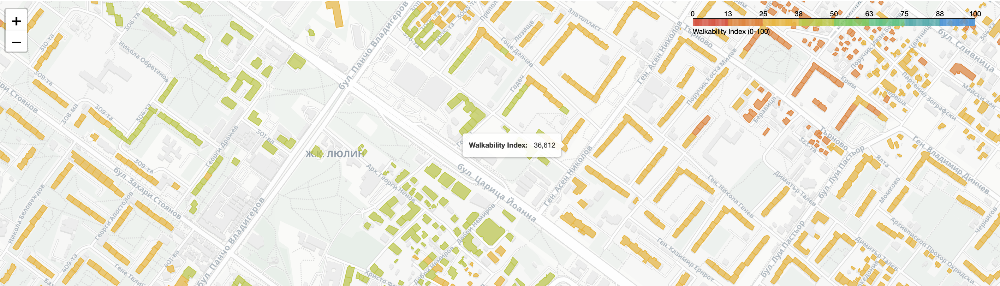

<p align="center">
	
</p>

# Индекс на пешеходна достъпност за София

Проектът изчислява индекс на пешеходна достъпност за жилищни сгради, като комбинира:

- пешеходна мрежа чрез PostGIS и pgRouting
- обществени обекти, или Points of Interest
- най-къси пешеходни разстояния по съществуващата мрежа

Резултатът е интерактивна карта с цветно кодирани стойности от 0 до 100.

## Какво е използвано

- Python 3.12
- PostgreSQL, PostGIS и pgRouting
- GeoPandas, pandas, SQLAlchemy и psycopg2
- Folium и Leaflet
- python-dotenv за конфигурация чрез `.env`

## Данни

Произходът на използваните данни се свежда до 3 основни източника:
- [*Публичния кадастър на Република България*](https://kais.cadastre.bg/bg/OpenData), посредством който бяха извлечени данните за жилищните сгради за райони "Люлин" и "Връбница"
- [*Софияплан*](https://sofiaplan.bg/api/), от който са взети данни за точки на интерес от общински характер - детски градини, паркове, учебни заведения, пътна мрежа и т.н
- Openstreet Map Data via [*OverPass API*](https://overpass-turbo.eu), от който са взети останалите данни за точки от интерес - частни бизнеси, медицински заведения, т.н.

## Структура на проекта

- `db/ingestion` - добавяне на PostGIS и pgRouting екстеншъни към PostGreSQL контейнера, както и зареждане на GeoJSON-ите в базата данни
- `db/network` - изграждане на топология, базирана на пешеходната мрежа и апроксимиране на най-близки точки за всеки обект до пешеходната мрежа
- `db/analysis` - изчисляване на разстояния посредством претегления граф и пресмятане на пешеходния индекс (по формула, описана по-надолу)
- `db/visualization` - визуализация чрез Leaflet & Folium

Отделно:
- `data_parser` - използван за трансформиране на кадастрални данни към GeoJSON формат.  

## Формула за изчисляване


Алгоритъмът за пресмятане на индекс на пешеходната достъпност е вдъхновен от вече съществуващ такъв подход, разработен в научна статия. [Научният труд е наличен в ScienceDirect](https://www.sciencedirect.com/science/article/pii/S026427512500472X?via%3Dihub)

За всяка категория $i$:

- $c_i$ - тегло на категорията
- $d_i$ - най-късо пешеходно разстояние от сградата до категорията
- $\lambda$ - коефициент на "затихване" (decay constant)

Изчислението е:

$$
f_i = e^{-\lambda d_i}
$$

Крайният индекс е:

$$
walkability\_index = 100 \times \frac{\sum (c_i \times f_i)}{\sum c_i}
$$


## Настройки

Базата данни се стартира локално чрез Docker Compose.

Стартиране на базата:

```bash
docker compose up
```

Спиране на базата:

```bash
docker compose down -v
```

Основните настройки са в `db/config.py`:

- входни слоеве: buildings, pedestrian_network, POI
- коефициенти по категории
- `decay rate`
- връзка към базата чрез `.env`

Необходими `.env` променливи:

- `DB_USER`
- `DB_PASS`
- `DB_HOST`
- `DB_PORT`
- `DB_NAME`

## Изпълнение

От корена на проекта:

```bash
./.venv/bin/python -m db all
```

Тази команда зарежда данните, изгражда топологията и преизчислява индекса.

Само преизчисляване на индекса и картата:

```bash
./.venv/bin/python -m db walkability
./.venv/bin/python -m db map
```

Списък на стъпките:

```bash
./.venv/bin/python -m db --list
```

## Изходни данни

Картата се записва в `index.html` и е финалният резултат от проекта.
